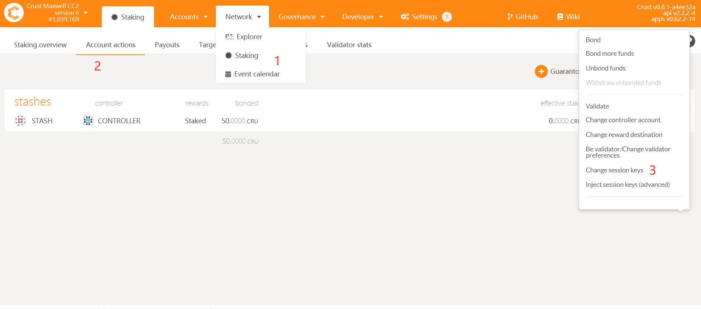
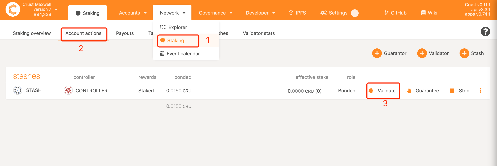

## 1. Overview


### 1.1 Node Responsibility

The Isolation node is a full-featured node of Crust Network, which undertakes core functions such as block generation, storage, and file transfer on a device. Therefore, support for SGX is necessary. The Isolation node account is connected to chain through the session key and the report of storage information works with configuring backup files. 

### 1.2 Hardware Spec

For an isolation node, you need to run both chain module and storage module on your device, so your device needs to support SGX. Additionally, since the block generation process and the storage proving process both have high demands for network stability, similar to projects in Polkadot ecology, we strongly recommend that the block generation node use a fixed public network IP, otherwise it will be punished due to any unstable block generation. For detailed configuration requirements and recommendations, please refer to the official [hardware spec](node-Hard-wareSpec.md).

## 2. Ready to Deploy

### 2.1 Create your Accounts

Refer to [bond accounts](new-bond.md) to create your stash and controller accounts.

Notices:

* Reserve 5 CRUs as a transaction fee (cannot be locked) for sending work reports. It is recommended you check the remaining status of reserves from time to time;
* Make sure that the account is unique, and that one machine corresponds only to one group of Controller&Stash accounts.

### 2.2 Setup BIOS

The SGX (Software Guard Extensions) module of the machine is closed by default. In the BIOS settings of your machine, you can set SGX to 'enable' and turn off Secure Boot (some types of motherboard do not support this setting). If your SGX only supports software enabled, please refer to this link [https://github.com/intel/sgx-software-enable](https://github.com/intel/sgx-software-enable).


### 2.3 Download Crust Node Package

a. Download

```plain
wget https://github.com/crustio/crust-node/archive/v0.8.0.tar.gz
```
b. Unzip
```plain
tar -xvf v0.8.0.tar.gz
```
c. Go to package directory
```plain
cd crust-node-0.8.0
```
### 2.4 Install Crust Service

Notices:

* The program will be installed under /opt/crust, please make sure this path is mounted with more than 250G of SSD space;
* If you have run a previous Crust testnet program on this device, you need to close the previous Crust Node and clear the data before this installation. For details, please refer to section 6.2;

* The installation process will involve the download of dependencies and docker images, which is time-consuming. Meantime, it may fail due to network problems. If it happens, please repeat the process until the installation is all complete.

Installation:

```plain
sudo ./install.sh
```
## 3. Node Configuration

### 3.1 Edit Config File

Execute the following command to edit the node configuration file:
```plain
sudo crust config set
```
### 3.2 Change Node Name

Follow the prompts to enter the name of your node, and press Enter to end:


### 3.3 Choose Mode

Follow the prompts to enter a node mode, and press Enter to end:


### 3.4 Config Controller Account

Enter the backup of the controller account as prompted and press Enter to end:


Enter the password for the controller backup file as prompted and press Enter to end:


### 3.5 Config Hard Disks

> Disk organization solution is not unitary. If there is a better solution, you can optimize it yourself.

With Crust as a decentralized storage network, the configuration of your hard disks becomes quite important. The node storage capacity will be reported to the Crust Network as reserved space, and this will determine the stake limit of this node.

Hard disk mounting requirements:

* Chain data and related DB data will be stored in /opt/crust/data directory. It is recommend you mount your SSD to this directory;

* The storage order file and SRD (Sealed Random Data, the placeholder files) will be written into the /opt/crust/data/files directory, it is recommended you mount the HDD to this directory. Initially, each device can be configured with up to 200TB of reserved space.

Suggestions for mounting HDDs:

* **Disk organization solution is not unitary. If there is a better solution, you can optimize it yourself.**
* If you only have one HDD, mount it directly to /opt/crust/data/files;
* For multiple HDDs, you can use LVM technology to organize these hard disks into a device and mount them to the /opt/crust/data/files directory. Please use LVM stripe to improve the storage performance;
* For disks with low stability, it is recommended you make several RAID5/RAID10 groups first, each with no more than 6 hard disks, and then use LVM to combine each group;

You can use the following command to view the file directory:

```plain
sudo crust tools space-info
```
### 3.6 Review the Configuration (Optional)

Execute following command to view the configuration file:

```plain
sudo crust config show
```
## 4. Start Node

### 4.1 Preparation

To start with, you need to ensure that the following ports are not occupied: 30888 19944 19933 (occupied by crust chain), 56666 (occupied by crust API), 12222 (occupied by crust sWorker), and 5001 4001 37773 (occupied by IPFS)

Then open the P2P port:

```plain
sudo ufw allow 30888
```

### 4.2 Start


```plain
sudo crust start
```
### 4.3 Check Running Status

```plain
sudo crust status
```

If the following five services are running, it means that Crust node started successfully.


### 4.4 Set SRD ratio and node storage capacity

Please wait about 2 minutes and execute the following commands.

a. SRD ratio refers to the upper limit of the hard disk used by SRD files, the default is 70%, and its range is 0% ~ 95%. For example, suppose the hard disk capacity is 1000GB and the SRD ratio is 70%. At this time, sWorker will reserve 30% of the space without SRD, so the total amount of SRD you can set is 700G.

This parameter is to ensure that the hard disk works in the optimal status, so that the machine can quickly accept and process meaningful file orders. After the opening of the storage market, the income of meaningful files of the same size is up to 5 times that of SRD. At the same time, the efficiency of some hard disks and hard disk organization methods will be very low when the hard disk is fully loaded, and even affect the reporting of work reports. **This parameter is related to the performance of the hard disk, please decide by yourself, you can change it by calling the following interface**, for example, set to 75%:

```plain
sudo crust tools set-srd-ratio 75
```

b. Assuming you have 500G of space under /opt/crust/data/files, and the SRD ratio is 80%, sWorker will keep the hard disk with 20% free space, then set 400G, as follows:

```plain
sudo crust tools change-srd 400
```

c. These commands may fail to execute. This is because sworker has not been fully started. Please wait a few minutes and try again. If it still does not work, please execute the subordinate monitoring commands to troubleshoot the error:

```plain
sudo crust logs sworker
```
### 4.5 Monitor

Run following command to monitor your node, and press 'ctrl-c' to stop monitoring：

```plain
sudo crust logs sworker
```

The monitoring log is as follows:
* (1) Indicating that the block is being synchronized. The process takes a long time;

* (2) Having successfully registered your on-chain identity;
* (3) Storage capacity statistics calculation in progress, which takes place gradually;
* (4) Indicating that the storage status has been reported successfully. The process takes a long time, about half an hour.


## 5. Blockchain Validate

### 5.1 Get session key

Please wait for the chain to synchronize to the latest block height, and execute the following command:

```plain
sudo crust tools rotate-keys
```
Copy the session key as shown below:


### 5.2  Set session key

Enter [CRUST APPs](https://apps.crust.network/), click on "Staking" button under "Network" in the navigation bar, and go to "Accounting action". Click on the setting button on the right of your stashes(a 3-dots button) and click on "Change session key".



Fill in the sessionkey you have copied, and click on “Set session key”.


### 5.3 Be a Validator/Candidate

Follow the steps below:



After one era, you can find your account listed in the "Staking" or "Waiting" list, which means you have completed all the steps.


## 6. Restart and Uninstall

### 6.1 Restart

If the device or Crust node related programs need to be somehow restarted, please refer to the following steps. 

**Please note**: This section only concerns restarting steps of Crust nodes, not including the basic software and hardware environment settings and inspection related information, such as hard disk mounting, IPFS configurations, etc. Please ensure that the hardware and software configuration is correct, and perform the following steps:


```plain
sudo crust reload
```
### 6.2 Uninstall and Data Cleanup


If you have run a previous version of Crust test chain, or if you want to redeploy your current node, you need to clear data from three sources:

* Delete basic Crust files under /opt/crust/data
* Clean the SRD file under the "srd_paths" you configured (if you have run a version before 0.8.0)
* Clean node data under /opt/crust/crust-node by executing:
    ```plain
    sudo /opt/crust/crust-node/scripts/uninstall.sh
    ```

